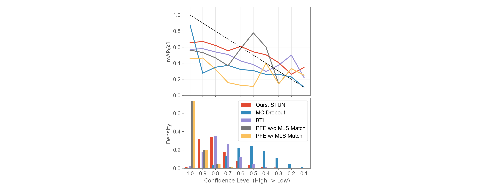

### [IROS2022] STUN: Self-Teaching Uncertainty Estimation for Place Recognition

#### 0. Environment Setup ⚙️
- Ubuntu 18.04, python 3.8, A100
- PyTorch 1.8.1 + CUDA 11.1

#### 1. Pittsburgh dataset and pretrained models 📨

```shell
bash ./download.sh
```

then the files will be downloaded and saved in the following folders:

```shell
pittsburgh
├── database
├── query
├── structure

logs
├── student_contrast
├── student_quadruplet
├── student_triplet
├── teacher_triplet

```

#### 2. Evaluate STUN 🔍

1. STUN

   ```python
   python main.py  --resume=logs/student_triplet/ckpt.pth.tar
   ```
2. STUN (Constrast)

   ```python
   python main.py --resume=logs/student_constrast/ckpt.pth.tar
   ```
3. STUN (Quadruplet)

   ```python
   python main.py --resume=logs/student_quadruplet/ckpt.pth.tar
   ```
4. Standard Triplet

   ```python
   python main.py --phase=test_tea	 --resume=logs/teacher_triplet/ckpt.pth.tar
   ```

#### 3. Plot results 📈

```python
python vis_results.py
# you can plot results of different models by populate the NETWORK variable.
```



|                                    |                     r@1/5/10 ↑                     |                    mAP@1/5/10 ↑                    |      AP ↑      |         ECE{r@1/5/10}↓         |             ECE{mAP@1/5/10}↓             |    ECE{AP}↓    |
| :---------------------------------: | :--------------------------------------------------: | :--------------------------------------------------: | :--------------: | :------------------------------: | :----------------------------------------: | :--------------: |
|          Standard Triplet          |                0\.548 / 0.802 / 0.877                |                0\.548 / 0.268 / 0.167                |      0\.678      |                -                |                     -                     |        -        |
|             MC Dropout             |                0\.302 / 0.523 / 0.611                |                0\.302 / 0.108 / 0.061                |      0\.463      |      0\.205 / 0.075 / 0.112      | 0\.205 / **0.396** / **0.443** |      0\.111      |
|             PFE w/o MLS             |                0\.550 / 0.805 / 0.876                |                0\.550 / 0.266 / 0.167                |      0\.690      | 0\.413 / 0.160 / **0.092** |           0\.413 / 0.695 / 0.795           |      0\.275      |
|             PFE w/ MLS             |                0\.444 / 0.680 / 0.764                |                0\.444 / 0.199 / 0.120                |      0\.655      |      0\.517 / 0.284 / 0.200      |           0\.517 / 0.762 / 0.841           |      0\.336      |
|                 BTL                 |                0\.515 / 0.766 / 0.840                |                0\.515 / 0.252 / 0.158                |      0\.591      | 0\.236 / **0.058** / 0.105 |           0\.236 / 0.497 / 0.591           |      0\.131      |
|        **Ours: STUN**        | **0\.613** / **0.840** / **0.898** | **0\.613** / **0.280** / **0.171** | **0\.739** | **0\.171** / 0.084 / 0.127 |      **0\.171** / 0.491 / 0.600      | **0\.067** |
| **Ours:  STUN (Contrastive)** |                0\.512 / 0.767 / 0.845                |                0\.512 / 0.204 / 0.119                |      0\.610      |      0\.185 / 0.086 / 0.152      |           0\.185 / 0.493 / 0.577           |      0\.054      |
|  **Ours: STUN (Quadruplet)**  |                0\.625 / 0.846 / 0.902                |                0\.625 / 0.294 / 0.180                |      0\.740      |      0\.114 / 0.140 / 0.194      |           0\.114 / 0.412 / 0.524           |      0\.072      |
